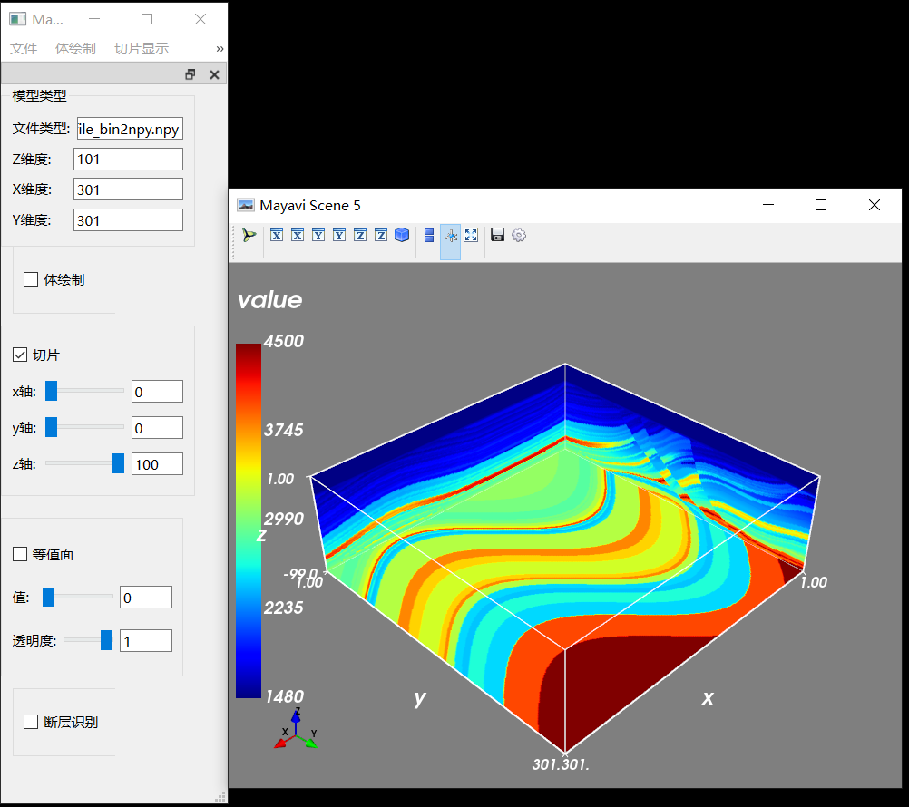
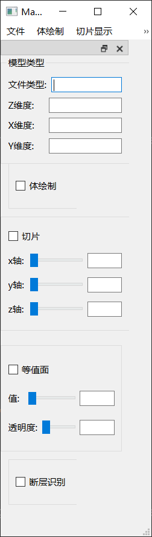

### 基于地震数据的三维可视化显示

该系统只针对于三维数据体进行操作，不支持二维数据。

#### 系统功能

##### 模块1：文件加载。

目前支持的文件格式有：.segy或sgy(标准的格式的segy或sgy文件)、.bin、.npy。

其中.bin文件需要进行手动数据数据的维度。

##### 模块2：体绘制。

目前的体绘制是基于曲面绘制而成的，只绘制了物体的表面形态，没有对内部细节进行展示出来，后期会增加含有内部信息特征的体绘制（整体有透明度的）。

体绘制(基于曲面绘制)展示：


##### 模块3：切片。

三维地震数据切片的展示，包括x,y,z三个维度上的滑动。

效果展示：



##### 模块4：等值面。

可以进行提取数据中某一特定值在三维空间上的分布。


##### 模块5：断层识别。

可以对三维地震数据进行三维断层面的识别。

合成地震数据：


断层标注数据：


断层识别结果：


系统主题界面：



#### 环境安装：

如果你是windows10的系统，直接配置好的环境压缩包ai_display.zip进行解压，然后将ai_display文件夹放到conda_env(conda的环境目录下即可)。这样可以省去环境配置工作。

环境包链接：链接: https://pan.baidu.com/s/1Z1PkTIbN5PABweObEzjpWg 提取码: 7mfc 


如果是别的系统，请按照下面这个顺序安装相关库：

```python
#安装步骤
pip install -i https://pypi.tuna.tsinghua.edu.cn/simple vtk
numpy
traits
mayavi
PyQt6
pyqt6-tools
pyqtwebengine # pyqt6-webengine
pyside2
```


#### 提供数据集

数据集在data文件夹中，其中提供了一个标准的.segy数据,  .npy数据,  .bin数据
数据集链接：链接: https://pan.baidu.com/s/10iCgeQHjZ81cIkVlZ87b1Q 提取码: m593 


#### 最后希望本代码可以给你提供帮助

